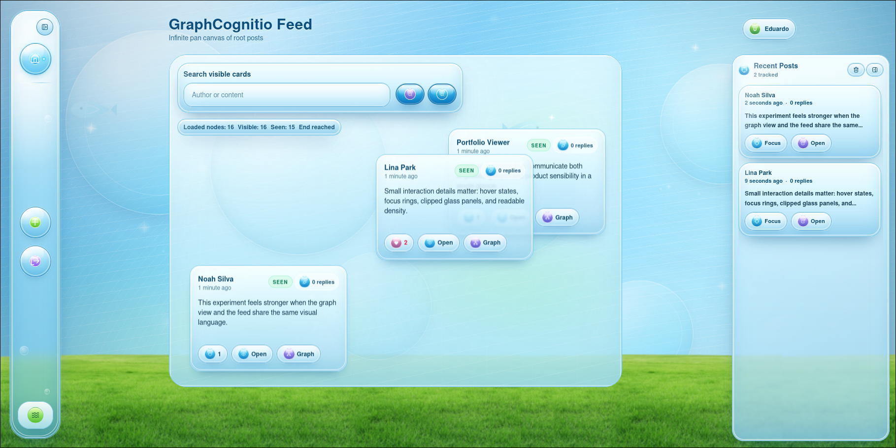
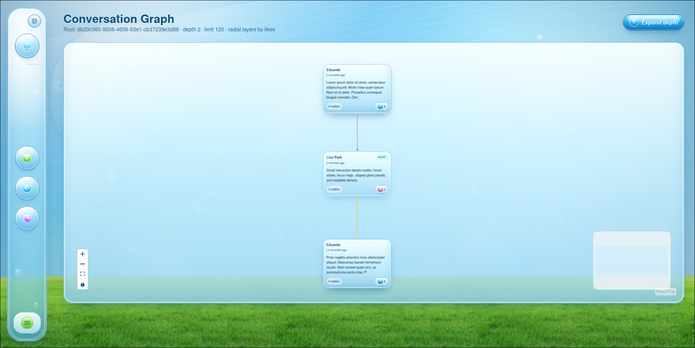
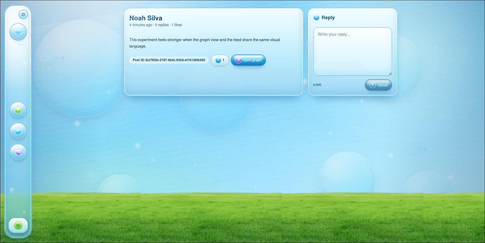
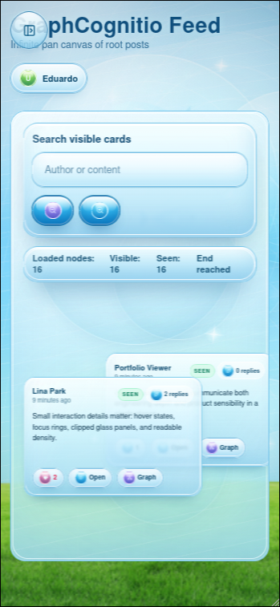

# GraphCognitio Frontend

React + TypeScript frontend for GraphCognitio, a graph-oriented social product with a Frutiger Aero interface, infinite feed canvas, and conversation graph exploration.

## Highlights

- Infinite root-post canvas with pan and zoom
- Dock navigation that collapses to icon orbs and expands to labeled actions
- Post detail flow with reply support
- Conversation graph view built with React Flow
- Mobile-friendly responsive layout

## Screenshots

Core product views:

<p align="center">
  
  
</p>

<p align="center">
  
  
</p>

Additional portfolio captures are available in [`docs/screenshots`](./docs/screenshots), including the dock navigation, create post flow, and login screen.

## Setup

1. Copy the example environment file:

```bash
cp .env.example .env
```

2. Set a public API base URL in `.env`:

```bash
VITE_API_BASE_URL=http://localhost:8080
```

`VITE_*` variables are bundled into client-side assets. Never place secrets in them.

## Scripts

```bash
npm install
npm run dev
npm run build
npm run preview
```

## Documentation

See [README-FRONTEND.md](./README-FRONTEND.md) for the full MVP scope, routes, UI system, and integration details.
